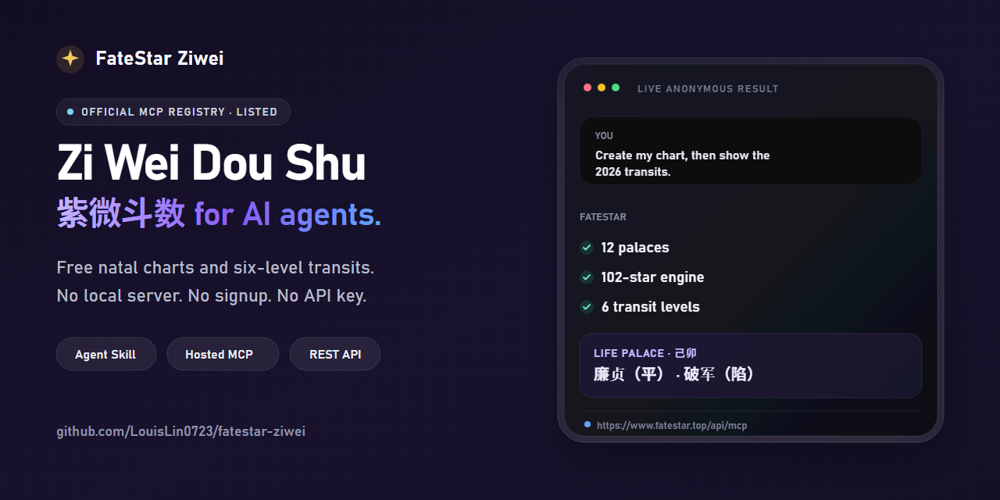

# FateStar 紫微斗数

一个专注紫微斗数的托管 MCP：只配一个 URL；免费本命盘与六层运限无需本地服务、安装包、账号或 API Key。也提供 Agent Skill 与 REST API。

[English](./README.md)

[](https://github.com/LouisLin0723/fatestar-ziwei/actions/workflows/validate.yml)
[](https://github.com/LouisLin0723/fatestar-ziwei/actions/workflows/live-contract.yml)
[](https://registry.modelcontextprotocol.io/v0.1/servers?search=io.github.LouisLin0723%2Ffatestar-ziwei)
[](https://github.com/LouisLin0723/fatestar-ziwei/releases)
[](https://github.com/LouisLin0723/fatestar-ziwei/stargazers)
[](./LICENSE)



本命盘与六层运限免费、支持匿名调用。「郑大钱」解读需要 FateStar API Key，并按积分规则计费。

## 立即体验

[打开一份实时匿名命盘结果](https://www.fatestar.top/api/ziwei?year=1990&month=7&day=23&hour=8&gender=male)，无需注册或 API Key。下面是这份结果中的部分字段：

```text
阳历 1990-7-23 | 农历 一九九〇年六月初二
五行局 土五局 | 命主 文曲 | 身主 火星
命宫 己卯 | 廉贞（平）、破军（陷）
十二宫 12 个 | 检出格局 5 个 | 本命四化 4 个
```

装好 Skill 或连上 MCP 后，直接对 Agent 说：

> 帮我排 1990 年 7 月 23 日早上 8 点出生男性的紫微盘，再看 2026 年运限。

Agent 会调用 FateStar，并返回：

- 十二宫、星曜、庙旺亮度与生年四化；
- 传入经度与时区后的真太阳时修正；
- 大限、小限、流年、流月、流日、流时；
- 配置有效 Key 且积分足够时，可选用「郑大钱」解读。

如果现场结果对你有用，欢迎[点一个 Star](https://github.com/LouisLin0723/fatestar-ziwei)，让更多 Agent 开发者找到这个免费端点。

## 为什么选 FateStar

FateStar 刻意做窄：让 AI Agent 不用维护本地命理服务，也能直接取得紫微命盘数据。

| 选择 | 更适合的情况 |
| --- | --- |
| **FateStar** | 现在就要托管远程 MCP：一个 URL、匿名免费排盘、六层运限、原生结构化 MCP 输出，并已进入官方 Registry。 |
| [Iztro](https://github.com/SylarLong/iztro) | 需要把开源紫微引擎嵌入自己的程序，并检查或修改底层实现。 |
| [Taibu](https://github.com/hhszzzz/taibu) 或 [Horosa Skill](https://github.com/Horace-Maxwell/horosa-skill) | 更重视多术数覆盖或离线工具，而不是专注紫微的托管端点。 |

这是部署方式与产品范围的差异，不代表某个流派或引擎在所有情况都更准确。

## 快速开始

### Agent Skill

GitHub CLI 2.90 以上可把 Skill 直接装进 Codex、Claude Code、Cursor 等 Agent。

```bash
# Codex
gh skill install LouisLin0723/fatestar-ziwei ziwei-paipan --agent codex --scope user

# Claude Code
gh skill install LouisLin0723/fatestar-ziwei ziwei-paipan --agent claude-code --scope user

# Cursor
gh skill install LouisLin0723/fatestar-ziwei ziwei-paipan --agent cursor --scope user
```

重启 Agent 后，直接要求它排紫微盘。标准 Skill 位于 [`skills/ziwei-paipan`](./skills/ziwei-paipan)。

如果 GitHub CLI 版本较旧，请先按[官方安装说明](https://github.com/cli/cli#installation)升级，也可手动把 `skills/ziwei-paipan` 目录复制到 Agent 的 Skill 目录。

### 远程 MCP

无需启动本地服务。支持 Streamable HTTP 的 MCP 客户端只要配置一个 URL：

```jsonc
{
  "mcpServers": {
    "fatestar-ziwei": {
      "url": "https://www.fatestar.top/api/mcp"
    }
  }
}
```

端点提供 `ziwei_chart`、`ziwei_transits`、`ziwei_reading`。前两个工具免费且可匿名使用。

`tools/list` 会为每个工具声明 `outputSchema` 与行为 annotations。成功调用同时返回原生 `structuredContent` 和旧版 JSON 文本：新 Agent 可直接读取结构化字段，旧客户端仍然兼容。

该服务已在官方 MCP Registry 登记为 [`io.github.LouisLin0723/fatestar-ziwei`](https://registry.modelcontextprotocol.io/v0.1/servers?search=io.github.LouisLin0723%2Ffatestar-ziwei)。

### REST API

无需注册即可执行免费排盘：

```bash
curl "https://www.fatestar.top/api/ziwei?year=1990&month=7&day=23&hour=8&gender=male"
```

完整 API 与客户端文档：[fatestar.top/docs](https://www.fatestar.top/docs)

## 选哪种接入

| 接入方式 | 适合谁 | 安装方式 | 免费排盘 |
| --- | --- | --- | --- |
| Agent Skill | Codex、Claude Code、Cursor 等编码 Agent | `gh skill install` | 支持 |
| 远程 MCP | 支持远程 HTTP 的 MCP 客户端 | 配置一个 URL | 支持 |
| REST API | App、脚本与后端服务 | `curl` 或 HTTP 客户端 | 支持 |

三种方式调用同一个 FateStar 引擎，只需按客户端选择入口。

## 能力

| 能力 | 费用 | 内容 |
| --- | --- | --- |
| 本命盘 | 免费 | 公历/农历、十二宫、102 颗星、庙旺亮度、生年四化 |
| 六层运限 | 免费 | 大限、小限、流年、流月、流日、流时 |
| 真太阳时 | 免费 | 传入经度与时区后启用 |
| 郑大钱解读 | 积分 | FateStar 知识引擎与托管解读服务 |

Skill 提供 Python、Node.js、PowerShell、Bash 四套客户端。Python 与 Node.js 只使用标准库，无需安装额外包。

## CLI 示例

在安装后的 `ziwei-paipan` Skill 目录运行：

```bash
# 免费本命盘
python scripts/ziwei_cli.py chart \
  --year 1990 --month 7 --day 23 --hour 8 --gender male

# 免费查看 2026 年六层运限
python scripts/ziwei_cli.py transits \
  --year 1990 --month 7 --day 23 --hour 8 --gender male \
  --target-year 2026

# 郑大钱解读，需要 FATESTAR_API_KEY
python scripts/ziwei_cli.py reading \
  --year 1990 --month 7 --day 23 --hour 8 --gender male \
  --question "看我今年事业运，该不该换工作？"
```

运行 `python scripts/ziwei_cli.py doc` 可离线查看完整接口规范。同一目录还提供 Node.js、PowerShell 与 Bash 客户端。

## API Key 与计费

`chart` 与 `transits` 无论是否带 Key 都免费。带 Key 只用于把免费调用归属到你的账号。

`reading` 需要 `FSFSKey`，并可能消耗积分。可在 [FateStar 开发者中心](https://www.fatestar.top/finance/developer)创建。Key 应放在源码之外：

```bash
export FATESTAR_API_KEY="FSFSKey_your_key"
```

MCP 客户端只有调用 `ziwei_reading` 时才需要发送 `Authorization: Bearer FSFSKey_your_key`。不要把真实 Key 提交到仓库或贴进 Issue。

## 仓库结构

```text
skills/ziwei-paipan/
├── SKILL.md
├── agents/openai.yaml
├── scripts/
│   ├── ziwei_cli.py
│   ├── ziwei_cli.js
│   ├── ziwei_cli.ps1
│   ├── ziwei_cli.sh
│   └── shared/
```

根目录 [`server.json`](./server.json) 使用 MCP Registry 官方格式描述远程端点。

## 开发与验证

```bash
python skills/ziwei-paipan/scripts/generate.py --check
python tests/live_contract_check.py
python skills/ziwei-paipan/scripts/ziwei_cli.py doc
node skills/ziwei-paipan/scripts/ziwei_cli.js doc
powershell -ExecutionPolicy Bypass -File skills/ziwei-paipan/scripts/ziwei_cli.ps1 doc
bash skills/ziwei-paipan/scripts/ziwei_cli.sh doc
```

四套客户端共用生成常量与离线接口规范。修改共享文件后先执行 `generate.py`，再运行上述检查。
完整兼容性测试矩阵见 [`docs/TEST_PLAN.md`](./docs/TEST_PLAN.md)。线上 MCP 实际检查项与限制见 [`docs/VERIFICATION.md`](./docs/VERIFICATION.md)。

## 开源边界

本仓库包含 Agent Skill、四套 thin client、接入元数据与公开文档。FateStar 服务端实现、私有 prompt、郑大钱训练数据、检索语料、评测集和计费风控不在本仓库内。

仓库代码采用 MIT License。FateStar 品牌、托管服务与私有知识资产仍为 FateStar 所有。

## 参与贡献

欢迎提交兼容性修复、客户端示例和可复现的问题。提交 PR 前请阅读 [CONTRIBUTING.md](./CONTRIBUTING.md)。安全问题请按 [SECURITY.md](./SECURITY.md) 私下报告，不要公开提交 Issue。
